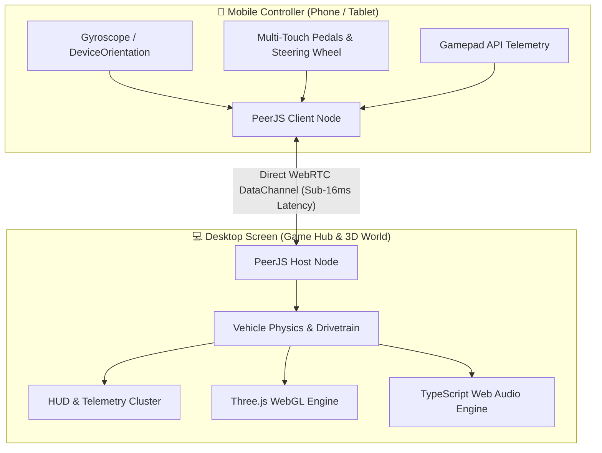

# 🏎️ Dr. Vice — Next-Gen P2P Web Racing & Mobile Controller

<div align="center">

[](https://webrtc.org/)
[](https://threejs.org/)
[](https://www.typescriptlang.org/)
[](https://web.dev/progressive-web-apps/)
[](LICENSE)

<p align="center">
  <b>A zero-install, ultra-low-latency 3D WebGL racing simulator powered by Three.js and real-time WebRTC peer-to-peer mobile phone steering.</b>
</p>

[🎮 Live Demo](#-quick-start) • [✨ Key Features](#-key-features) • [🏗️ Architecture](#-system-architecture) • [🚀 Getting Started](#-quick-start)

</div>

---

## 🌟 Overview

**Dr. Vice** transforms any modern smartphone into a low-latency, motion-sensing wireless steering wheel for desktop 3D car racing—**with zero app installation required**. 

By scanning a dynamic QR code on the desktop game screen, a secure direct **WebRTC Data Channel** connects the phone and PC. Gyroscope tilt, analog pedals, gear shifts, and tactile haptics stream between devices in real-time with sub-frame input lag.

---

## ✨ Key Features

### 🤳 1. Instant Peer-to-Peer Mobile Controller
* **Zero-Setup Pairing**: Instant connection handshake via QR code scan or clean host ID matching.
* **Gyroscope / Tilt Steering**: Utilizes the DeviceOrientation API to convert physical phone rotation into precise car steering angle.
* **Multi-Touch Analog Pedals**: Custom multi-touch engine handling concurrent throttle, brake, reverse, and emergency handbrake inputs.
* **Hardware Haptic Feedback**: Dynamic vibration triggers responding to rev limiters, downshifts, and hard braking.

### 🎮 2. Multi-Input Support & Gamepad API
* **Physical Controller Dashboard**: Seamless plug-and-play support for Xbox / PlayStation / USB gamepads with live trigger pressure visualizers and stick telemetry.
* **Smart Input Switching**: Seamless runtime switching between Keyboard, Mobile Remote, and Gamepad.

### 🚗 3. Realistic Vehicle Physics & Dynamic Drivetrains
* **Interactive Drivetrain Modes**: Switch dynamically between **RWD** (Rear Wheel Drive), **FWD**, **50/50 AWD**, and **Sport 20/80 AWD**.
* **Drift & Slip Dynamics**: Real-time tire grip simulation, drift angle estimation, body roll, counter-steering, and burnout physics.
* **Manual & Auto Transmission**: Configurable gear ratios, clutch simulation, shift delays, and tachometer redline shift lights.

### 🔊 4. Web Audio Engine & Sound Studio
* **Interactive Synthesis**: Multi-sample granular engine audio written in TypeScript with realistic pitch warping across the RPM curve.
* **Sound Profiles**: Built-in sound banks including *Ferrari 458 Flat-Plane V8*, *BAC Mono*, and *BMW M1 Procar Classic Inline-6*.
* **In-Game Sound Trainer**: Interactive audio studio allowing users to adjust limiter curves, rev inertia, and upload custom exhaust audio.

### 📱 5. PWA (Progressive Web App) & Mobile Optimization
* Service Worker (`sw.js`) caching for instant load times and offline readiness.
* Automatic orientation locking to landscape mode and viewport touch gestures prevention.

---

## 🏗️ System Architecture



---

## 🛠️ Tech Stack & Engineering Highlights

| Component | Technology | Purpose |
| :--- | :--- | :--- |
| **3D Rendering** | [Three.js](https://threejs.org/) (WebGL) | Smooth 60+ FPS vehicle rendering, dynamic shadows, track camera systems |
| **P2P Networking** | [PeerJS](https://peerjs.com/) / WebRTC DataChannels | Direct browser-to-browser UDP-like low-latency input streaming |
| **Audio Simulation**| TypeScript, Web Audio API | Granular multi-sample RPM interpolation, limiter audio, throttle modulation |
| **QR Generation & Scanning** | `qrcodejs`, `html5-qrcode` | Client-side visual pairing between phone camera and host screen |
| **App Shell** | Vanilla HTML5 / Modern CSS / JS (ESM) | Ultra-lightweight bundle with zero heavy framework overhead |
| **Application Type** | PWA (Progressive Web App) | Offline capability and native standalone display modes |

---

## 🚀 Quick Start & Local Setup

### Prerequisites
* [Node.js](https://nodejs.org/) (v16 or newer recommended)

### 1. Clone the repository
```bash
git clone https://github.com/Chaudhary-Kaushal-195/remote-control.git
cd remote-control
```

### 2. Install dependencies & launch
```bash
npm install
npm start
```
*The local server will spin up at `http://localhost:3000` (or the port specified by `serve`).*

### 3. Audio Engine Development (Optional)
To build or tweak the TypeScript audio engine:
```bash
npm run dev-audio    # Start Vite development server for audio-engine
npm run build-audio  # Compile TypeScript into production bundle
```

---

## 🎮 How to Play

1. **Launch Desktop Game**: Open `pages/cargame.html` on your PC/Laptop browser.
2. **Connect Phone Controller**:
   - Click **`🤳 SYNC PHONE`** at the top left.
   - Scan the on-screen QR Code using your phone camera (or enter the 4-character ID on `pages/controller.html`).
3. **Drive!**
   - **Tilt Phone**: Steer the car left / right.
   - **Right Pedal (GAS)**: Accelerate.
   - **Center Pedal (STOP)**: Brake / Reverse.
   - **Top Controls**: Toggle camera views, automatic/manual transmission, and settings on the fly.

---

## 🔒 Security & Privacy

* **Direct Peer-to-Peer**: All motion and controller inputs flow directly between your phone and laptop over encrypted WebRTC DataChannels.
* **No Tracking / No Cloud Storage**: No telemetry, analytics, personal credentials, or persistent user data is collected.
* **Ephemeral Sessions**: Connection pairing IDs are randomly generated per session and discarded when disconnected.

---

## 📂 Project Structure

```
├── css/                     # Componentized CSS stylesheets
│   ├── cargame/             # HUD, environment, modals, QR styles
│   ├── controller/          # Mobile pedals, steering, and gamepad UI
│   └── index.css            # Game hub launcher styling
├── javascript/              # Modular application logic
│   ├── cargame/             # Physics, WebRTC host, input manager, UI
│   └── controller/          # Sensor listeners, touch handlers, gamepad loop
├── pages/                   # Game entry points
│   ├── cargame.html         # Main 3D racing desktop interface
│   ├── controller.html      # Mobile controller web interface
│   └── index.html           # Cross-device launch hub
├── typescript/audio-engine/ # High-performance Web Audio engine
├── images/                  # Game visual assets and icons
├── manifest.json            # PWA manifest
├── sw.js                    # Service Worker caching
└── package.json             # Scripts & dev configuration
```

---

## 👏 Acknowledgements & Credits

* **Engine Sound Simulation**: Audio engine module adapted and ported from [Mark Oosting (markeasting)](https://github.com/markeasting) under the [MIT License](typescript/audio-engine/LICENSE).
* **3D Graphics**: Built using [Three.js](https://threejs.org/).
* **Peer-to-Peer Networking**: Powered by [PeerJS](https://peerjs.com/).

---

## 📄 License

This project is licensed under the [MIT License](LICENSE).

<div align="center">
  <sub>Built with ❤️ for high-performance web gaming.</sub>
</div>
